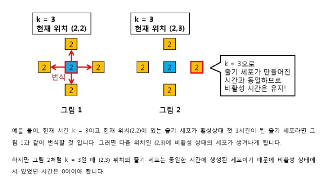
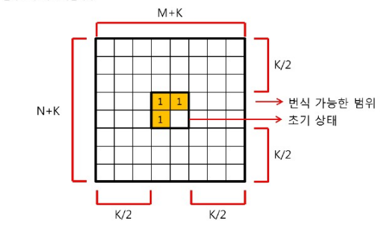
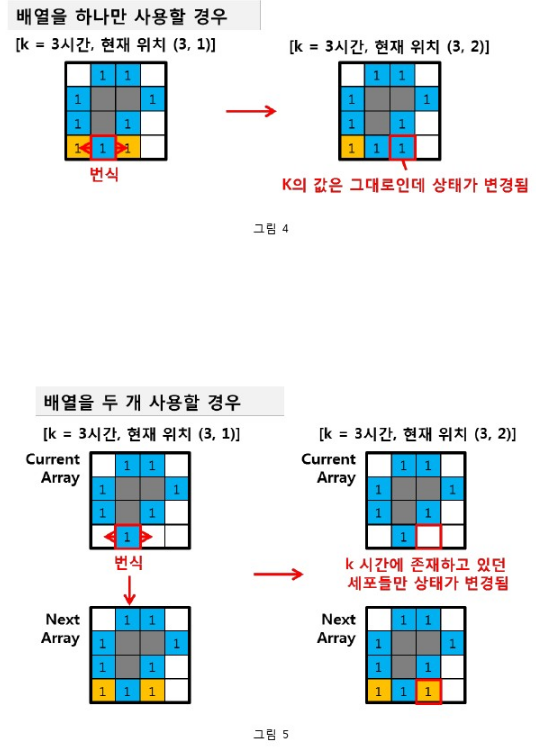
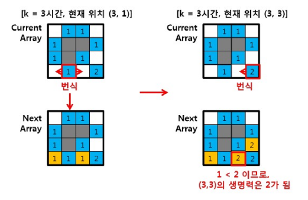

## 줄기세포 배양 해설 1차시

## 0. 워밍업

### SW 문제를 풀기 위한 5단계
- 1. 지문을 읽는다      : 지문을 읽고 핵심 부분을 파악한다.
- 2. 문제를 이해한다    : 핵심 부분에서 정확히 요구하는 것이 무엇인지 분석한다.
- 3. 문제를 풀어본다    : 노트에 손으로 문제를 풀어본다.
- 4. 풀이를 코딩한다    : 노트로 풀어본 내용을 소스코드로 코딩한다.
- 5. 디버깅하고 검증한다: 디버깅을 하고 예외가 발생하지 않는지 검증한다.

### 꼭 파악해야 할 핵심 부분 3가지
- 제한 시간 확인        : 문제의 제한 시간이 어느 정도인지 파악합니다.
- Big-O 계산하기        : Input값을 보고 Big-O를 계산해보고 제한 시간 내 풀 수 있는 문제인지 확인해 봅니다.
- 제약사항 확인하기     : 제약사항을 통해 문제 접근 시 주의해야 할 점이나, 문제 푸는 데 도움이 되는 힌트를 얻을 수 있습니다.

## 1. 목표 포착

### 정체 파악 - 문제 요구 사항
이 문제를 간단히 요약하면 아래와 같습니다.

- 1. 가로, 세로 크기가 1인 줄기세포가 세로 N, 가로 M인 영역에 분포되며
- 2. 생명력이 X인 줄기세포는 비활성 상태 X시간, 활성 상태를 X시간 이후 죽게 되고
- 3. 활성 상태 첫 1시간 동안 줄기세포가 상, 하, 좌, 우로 번식할 때
- 4. K시간 후, 배양 용기에 살아있는 줄기 세포를 구하는 문제입니다.

### 함정 조사 - 주의해야 할 점
- 1. 생명력 수치가 X인 줄기세포는 X시간의 비활성 상태 이후, 바로 활성 상태가 된다.
- 2. 줄기 세포는 죽더라도 소멸되지 않고 해당 그리드 셀을 차지한다.
- 3. 초기 줄기세포와 번식된 줄기세포는 모두 비활성 상태이다.
- 4. 하나의 셀에는 하나의 줄기 세포만 존재할 수 있다.
- 5. 세포가 번식하려는 방향에 이미 세포가 존재하는 경우, 해당 방향으로는 번식하지 않는다.
- 6. 두 개 이상의 줄기세포가 하나의 셀에 동시에 번식하려는 경우, 생명력 수치가 높은 줄기 세포만 번식됩니다.
- 7. 배양 시간(K)는 최대 300시간입니다.
- 8. 초기 상태에서 줄기 세포가 분포된 최대 크기(NxM)는 50x50입니다.
- 9. 배양 용기의 크기는 무한합니다.

**[일부 테스트 케이스만 틀릴 때 생각 할 점]**

동일한 시간에 생성된 줄기 세포는 비활성 상태에서의 시간이 증가되면 안됩니다.  


## 2. 전략 수립

### 대응 방안 구상 - 필요한 이론
해당 문제는 2차원 ㅂ열 내에 있는 줄기 세포의 상태를 확인하고, 상태 조건에 맞게 2차원 배열을 업데이트 해주어야 합니다. 때문에 다음과 같은 이론이 필요합니다.
1. 2차원 배열의 기본적 개념(배열 설계, 접근 인덱스 설계)
2. 2차원 배열의 탐색 방법(반복문, 완전탐색, 그리디)

### 공략 집 미리 보기 - 추천 학습 콘텐츠
배열에 대한 사전 직식 및 연습을 위해서 아래의 학습 콘텐츠를 추천합니다.
1. [SW 문제해결 기본 - Array 1](https://swexpertacademy.com/main/learn/course/subjectDetail.do?courseId=AVuPDN86AAXw5UW6&subjectId=AV183wv6I7QCFAZN&&)
2. [SW 문제해결 기본 - Array 2](https://swexpertacademy.com/main/learn/course/subjectDetail.do?courseId=AVuPDN86AAXw5UW6&subjectId=AV1835EaI7YCFAZN)

### 사전 답사 - 사전 추천 문제
이 문제를 혼자 해결하는 데 어려움이 있다면, 아래의 추천 문제를 풀어보세요 단계적 문제 해결법에 따라 단순히 코딩하는 것에 그치지 않고, 문제 해결 사고를 기르도록 해봅시다.

[2차원 배열 기본 개념 연습 문제]
1. [1209.[S/W 문제해결 기본]2일차 - Sum](https://swexpertacademy.com/main/code/problem/problemDetail.do?contestProbId=AV13_BWKACUCFAYh&categoryId=AV13_BWKACUCFAYh&categoryType=CODE)
2. [수의 새로운 연산](https://swexpertacademy.com/main/code/problem/problemDetail.do?contestProbId=AV2b-QGqADMBBASw)

[2차원 배열 탐색 연습 문제]
1. [4615. 재미있는 오셀로 게임](https://swexpertacademy.com/main/code/problem/problemDetail.do?contestProbId=AWQmA4uK8ygDFAXj&categoryId=AWQmA4uK8ygDFAXj&categoryType=CODE)
2. [1861. 정사각형 방](https://swexpertacademy.com/main/code/problem/problemDetail.do?contestProbId=AV5LtJYKDzsDFAXc&categoryId=AV5LtJYKDzsDFAXc&categoryType=CODE)
3. [4613. 러시아 국기 같은 깃발](https://swexpertacademy.com/main/code/problem/problemDetail.do?contestProbId=AWQl9TIK8qoDFAXj&categoryId=AWQl9TIK8qoDFAXj&categoryType=CODE)

## 3. 문제 파헤치기 - 이론

### 문제 분석 - 풀이에 대한 해설
이 해설은 이 문제를 통해 SW 문제해결 역량을 향상하기 위한 쉬운 해결법을 설명하고 해결법에 대한 코드까지 설명합니다.

[시간 복잡도 분석 및 2차원 배열의 최대 크기 계산]
K시간 이후에 살아있는 세포를 찾기 위해 매 시간 모든 세포들을 완전 탐색하여 상태를 업데이트 해주어야 합니다.  
먼저 초기에 줄기 세포는 NxM 크기의 사각형에 분포됩니다.  
이후에 배양을 시작하는데, 줄기 세포가 가장 빠르게 번식하는 경우는 2시간 마다 한 번식 번식을 하는 경우 입니다(생명력 X=1일 때 비호라성 상태 1시간+활성상태 첫 번째 시간=2)  
줄기 세포는 상, 하 , 좌, 우 네방향으로 모두 번식할 수 있기 때문에 줄기 세포가 최대로 분포할 수 있는 넓이는 (N+K)x(M+K)입니다.  


따라서 모든 줄기 세포를 K시간 동안 탐색하는 시간은 O((N+K)*(M+K)*K)입니다.  
N, M이 최대 50, K가 최대 300으로 대략적인 시간 복잡도는 O(K^3)으로 볼 수 있으며 세포의 분포를 저장할 2차원 배열의 최대 크기는 350x350이 됩니다.

[줄기 세포의 상태 저장 방법]

구조체를 활용하면 하나의 줄기 세포의 정보를 묶어서 관리할 수 있습니다.

```{.cpp}
struct data_type
{
    //0: 빈 공간, 1: 비활성 상태, 2: 활성 상태, 3: 죽은 상태
    int status;
    //LP: life point
    //MP: 죽은 상태: 0, 비활성 상태일 경우 증가, 활성 상태일 경우 감소
    int LP, MP;
} Map[2][MAX_K+MAX_M][MAX_K+MAX_M];
```

[2차원 배열에서 포기 세포의 위치와 배열의 경계 설정]  
모든 N, M, K값에서 사용할 수 있는 2차원 배열을 선언했으면, 초기 줄기 세포의 위치를 지정해줍니다.  
세포는 상, 하, 좌, 우로 최대 K.2만큼 번식할 수 있기 때문에 네 방향에 K/2만큼에 여유공간이 있어야 합니다.  
따라서 초기 배열의 위치는 {(K/2)+1, (K/2)+1}부터 시작하면 됩니다.

```{.cpp}
for(int i=K/2+1; i<N+K/2+1;i++)
{
    for(int j=K/2+1;j<M+K/2+1;j++)
    {
        cin >> Map[0][i][j].LP;
        if (Map[0][i][j].LP > 0)
        {
            Map[0][i][j].status = 1;
            Map[0][i][j].MP = 0;
        }
    }
}
```

[2차원 배열 탐색 및 배열 원소 업데이트]  
2차원 배열에서 세포가 탐색할 범위를 선택했으면 이제 탐색을 시작합니다.  
이 때, 현재 상태를 가지고 있는 2차원 배열과 다음 시간의 상태를 저장할 2차원 배열 2개를 사용해야 합니다.  
만약 한 개의 2차원 배열을 사용한다면 같은 시간에 생성된 세포의 상태 변화가 될 수 있기 때문입니다.

  
배열의 원소는 다음과 같이 업데이트 됩니다.  
(i, j)위치의 세포가
1. 죽은 세포일 경우, 현재 상태를 그대로 다음 턴에 넘겨줍니다.
2. 비활성 상태 세포일 경우, 다음 턴에 HP를 증가시켜주고 만약 비활성 시간과 생명력 시간이 같아진다면 다음 턴을 활성 상태로 만들어줍니다.
3. 활성 상태가 된 후 첫 번째 시간인 세포일 떄는 다음 두 가지 경우가 있을 수 있는데
    - 번식하는 위치가 현재 2차원 배열에는 비어있지만 다음 턴의 2차원 배열에는 비어있지 않을 경우
    - 다른 세포가 먼저 번식을 한 경우 입니다.

    이 때는 Life point가 큰 세포가 우선순위를 가지므로 두 세포를 비교해서 Life Point가 큰 세포를 다음 턴에 저장해줍니다.

  
4. 줄기 세포가 활성 상태이지만 첫 시간이 아닌 경우에는 HP를 감소 시켜주고, HP가 0이 되었을 때는 죽은 상태로 변경해줍니다. 상태 별 동작이 오나료되면, 다음 상태로 저장해둔 2차원 배열을 현재 상태로 바꿉니다. K 시간 동안 이 동작을 반볻해줍니다.

## 백문이 불여일견 - 소스 코드 분석

```{.cpp}
#include <iostream>
// 가능한 배열의 최대 크기 50+300
#define MAXL 352
using namespace std;

struct data_type
{
	//0: 빈 공간, 1: 비활성 상태, 2: 활성 상태, 3: 죽은 상태
	int status;
	//LP: life point
	//MP: 죽은 상태: 0, 비활성 상태일 경우 증가, 활성 상태일 경우 감소
	int LP, NP;
};

int T, N, M, K;
data_type Map[2][MAXL][MAXL];
int dir[4][2] = { {0,-1},{0,1},{1,0},{-1,0} };

int main()
{
	setbuf(stdout, NULL);
	cin >> T;

	for (int tc = 1; tc <= T; tc++)
	{
		cin >> N >> M >> K;
		//init
		for (int i = 0; i < N + K + 2; i++)
		{
			for (int j = 0; j < M + K + 2; j++)
			{
				Map[0][i][j].status = 0;
				Map[1][i][j].status = 0;
			}
		}

		//초기 줄기 세포의 Life Point
		for (int i = K / 2 + 1; i < N + K / 2 + 1; i++)
		{
			for (int j = K / 2 + 1; j < M + K / 2 + 1; j++)
			{
				cin >> Map[0][i][j].LP;
				if (Map[0][i][j].LP > 0)
				{
					Map[0][i][j].status = 1;
					Map[0][i][j].NP = 0;
				}
			}
		}

		// 줄기 세포가 K시간 내에 분포될 수 있는 최대 범위
		N = N + K + 2;
		M = M + K + 2;

		int curMap = 0;
		for (int k = 0; k < K; k++)
		{
			for (int i = 0; i < N; i++)
			{
				for (int j = 0; j < M; j++)
				{
					//죽은 세포일 경우
					if (Map[curMap][i][j].status == 3)
					{
						//아무 동작도 하지 않음
						Map[1 - curMap][i][j].status = Map[curMap][i][j].status;
						continue;
					}
					//비활성 상태일 경우
					else if (Map[curMap][i][j].status == 1)
					{
						//비활성 시간 증가
						Map[1 - curMap][i][j].NP = Map[curMap][i][j].NP + 1;
						Map[1 - curMap][i][j].LP = Map[curMap][i][j].LP;

						//비활성 시간이 LP만큼 지났을 경우
						if (Map[1 - curMap][i][j].NP == Map[1 - curMap][i][j].LP)
							//활성 상태로 변경
							Map[1 - curMap][i][j].status = 2;
						else
							Map[1 - curMap][i][j].status = 1;
					}
					//활성 상태일 경우
					else if (Map[curMap][i][j].status == 2)
					{
						//활성 상태가 된 후, 첫 시간일 경우
						if (Map[curMap][i][j].NP == Map[curMap][i][j].LP) //expansion
						{
							//현재 위치에서 상, 하, 좌, 우 탐색
							for (int d = 0; d < 4; d++)
							{
								int i2, j2;
								i2 = i + dir[d][0];
								j2 = j + dir[d][1];

								//줄기 세포가 번식하는 방향이 비어있는 경우
								if (Map[curMap][i2][j2].status == 0)
								{
									//하나의 줄기 세포가 번식하려고 하는 경우
									if (Map[1 - curMap][i2][j2].status == 0)
									{
										//해당 줄기 세포가 셀을 차지
										Map[1 - curMap][i2][j2].status = 1;
										Map[1 - curMap][i2][j2].LP = Map[curMap][i][j].LP;
										Map[1 - curMap][i2][j2].NP = 0;
									}
									//두 개 이상의 줄기 세포가 셀에 동시에 번식하려는 하는 경우
									//생명력(LP)가 높은 줄기 세포가 셀을 차지
									else if (Map[1 - curMap][i2][j2].status == 1 && Map[1 - curMap][i2][j2].LP < Map[curMap][i][j].LP)
										Map[1 - curMap][i2][j2].LP = Map[curMap][i][j].LP;
								}
							}
						}
						//활성 시간 증가
						Map[1 - curMap][i][j].NP = Map[curMap][i][j].NP - 1;
						//활성 상태 시간이 LP 시간 만큼 지났을 경우
						if (Map[1 - curMap][i][j].NP == 0)
							//줄기 세포가 죽음
							Map[1 - curMap][i][j].status = 3;
						else
							Map[1 - curMap][i][j].status = 2;
					}
				}
			}
			//다음 상태를 저장해 높은 map을 현재 map으로 변경
			curMap = 1 - curMap;
		}
		//살아 있는 줄기 세포 탐색
		int Answer = 0;
		for (int i = 0; i < N; i++)
		{
			for (int j = 0; j < M; j++)
			{
				if (Map[curMap][i][j].status == 1 || Map[curMap][i][j].status == 2)
					Answer++;
			}
		}
		cout << '#' << tc << " " << Answer << endl;
	}
	return 0;
}
```

## 4.다음 목표 찾기

**DFS**
[SW 문제해결 기본 - Stack1](https://swexpertacademy.com/main/learn/course/subjectDetail.do?courseId=AVuPDN86AAXw5UW6&subjectId=AV184o76I7sCFAZN)
[SW 문제해결 기본 - Stack1](https://swexpertacademy.com/main/learn/course/subjectDetail.do?courseId=AVuPDN86AAXw5UW6&subjectId=AV184uV6I70CFAZN)

**BFS**
[SW 문제해결 기본 - Queue](https://swexpertacademy.com/main/learn/course/subjectDetail.do?courseId=AVuPDN86AAXw5UW6&subjectId=AV1847saI78CFAZN)

**조금 더 어려운 것까지 보고 싶다면**
[SW 문제해결 응용 - 구현 - 완전검색](https://swexpertacademy.com/main/learn/course/subjectDetail.do?courseId=AVuPDYSqAAbw5UW6&subjectId=AV2dYG86Ac0BBASw)
[SW 문제해결 응용 - 구현 - 백트래킹](https://swexpertacademy.com/main/learn/course/subjectDetail.do?courseId=AVuPDYSqAAbw5UW6&subjectId=AV3Fvw66AAYBBARB)

**좀 더 어려운 배열 관련 문제**
[1961. 숫자 배열 회전](https://swexpertacademy.com/main/code/problem/problemDetail.do?contestProbId=AV5Pq-OKAVYDFAUq&categoryId=AV5Pq-OKAVYDFAUq&categoryType=CODE)
[1240. [SW 문제해결 응용]1일차 - 단순 2진 암호코드](https://swexpertacademy.com/main/code/problem/problemDetail.do?contestProbId=AV15FZuqAL4CFAYD)
[1240. [SW 문제해결 응용]1일차 - 암호코드 스캔](https://swexpertacademy.com/main/code/problem/problemDetail.do?contestProbId=AV15JEKKAM8CFAYD&categoryId=AV15JEKKAM8CFAYD&categoryType=CODE)

**탐색 관련 문제**
[2819. 격자판의 숫자 이어 붙이기](https://swexpertacademy.com/main/code/problem/problemDetail.do?contestProbId=AV7I5fgqEogDFAXB&categoryId=AV7I5fgqEogDFAXB&categoryType=CODE)
[1868. 파핑파핑 지뢰찾기](https://swexpertacademy.com/main/code/problem/problemDetail.do?contestProbId=AV5LwsHaD1MDFAXc&categoryId=AV5LwsHaD1MDFAXc&categoryType=CODE)

## 내 방식대로 리펙토링

```{.cpp}
#include <iostream>
// 가능한 배열의 최대 크기 50+300
#define MAXL 352
using namespace std;

enum Cell_status
{
	CELL_EMPTY = 0,
	CELL_INACTIVE = 1,
	CELL_ACTIVE = 2,
	CELL_DIE = 3
};

struct Data_type
{
	int status;
	//LP: life point
	//MP: 죽은 상태: 0, 비활성 상태일 경우 증가, 활성 상태일 경우 감소
	int LP, NP;
};

int t, n, m, k;
Data_type Map[2][MAXL][MAXL];
int dx[] = { 0,0,1,-1 };
int dy[] = { 1,-1,0,0 };

int main()
{
	ios::sync_with_stdio(false); cin.tie(0); cout.tie(0);

	cin >> t;

	for (int tc = 1; tc <= t; tc++)
	{
		cin >> n >> m >> k;
		//init
		for (int x = 0; x < n + k + 2; x++)
		{
			for (int y = 0; y < m + k + 2; y++)
			{
				Map[0][x][y].status = CELL_EMPTY;
				Map[1][x][y].status = CELL_EMPTY;
			}
		}

		//초기 줄기 세포의 Life Point
		for (int x = k / 2 + 1; x < n + k / 2 + 1; x++)
		{
			for (int y = k / 2 + 1; y < m + k / 2 + 1; y++)
			{
				cin >> Map[0][x][y].LP;
				if (Map[0][x][y].LP > 0)
				{
					Map[0][x][y].status = CELL_INACTIVE;
					Map[0][x][y].NP = 0;
				}
			}
		}

		// 줄기 세포가 K시간 내에 분포될 수 있는 최대 범위
		n = n + k + 2;
		m = m + k + 2;

		int cur = 0;
		for (int it = 0; it < k; it++)
		{
			for (int x = 0; x < n; x++)
			{
				for (int y = 0; y < m; y++)
				{
					Data_type &curMap = Map[cur][x][y];
					Data_type &tempMap = Map[1 - cur][x][y];
					if (curMap.status == CELL_DIE)
					{
						//아무 동작도 하지 않음
						tempMap.status = curMap.status;
						continue;
					}
					else if (curMap.status == CELL_INACTIVE)
					{
						//비활성 시간 증가
						tempMap.NP = curMap.NP + 1;
						tempMap.LP = curMap.LP;

						//비활성 시간이 LP만큼 지났을 경우
						if (tempMap.NP == tempMap.LP)
							tempMap.status = CELL_ACTIVE;
						else
							tempMap.status = CELL_INACTIVE;
					}
					else if (curMap.status == CELL_ACTIVE)
					{
						//활성 상태가 된 후, 첫 시간일 경우
						if (curMap.NP == curMap.LP) //expansion
						{
							//현재 위치에서 상, 하, 좌, 우 탐색
							for (int d = 0; d < 4; d++)
							{
								int nx, ny;
								nx = x + dx[d];
								ny = y + dy[d];
								Data_type &nCurMap = Map[cur][nx][ny];
								Data_type &nTempMap = Map[1 - cur][nx][ny];

								if (nCurMap.status == CELL_EMPTY)
								{
									//하나의 줄기 세포가 번식하려고 하는 경우
									if (nTempMap.status == CELL_EMPTY)
									{
										//해당 줄기 세포가 셀을 차지
										nTempMap.status = CELL_INACTIVE;
										nTempMap.LP = curMap.LP;
										nTempMap.NP = 0;
									}
									//두 개 이상의 줄기 세포가 셀에 동시에 번식하려는 하는 경우
									//생명력(LP)가 높은 줄기 세포가 셀을 차지
									else if (nTempMap.status == CELL_INACTIVE && nTempMap.LP < curMap.LP)
										nTempMap.LP = curMap.LP;
								}
							}
						}
						//활성 시간 증가
						tempMap.NP = curMap.NP - 1;
						//활성 상태 시간이 LP 시간 만큼 지났을 경우
						if (tempMap.NP == 0)
							tempMap.status = CELL_DIE;
						else
							tempMap.status = CELL_ACTIVE;
					}
				}
			}
			//다음 상태를 저장해 높은 map을 현재 map으로 변경
			cur = 1 - cur;
		}
		
		//살아 있는 줄기 세포 탐색
		int ans = 0;
		for (int x = 0; x < n; x++)
			for (int y = 0; y < m; y++)
				if (Map[cur][x][y].status == CELL_INACTIVE || Map[cur][x][y].status == CELL_ACTIVE)
					ans++;
		
		cout << '#' << tc << " " << ans << "\n";
	}
	return 0;
}

//TODO: DFS나 BFS로 바꿀것
//2중 for문으로 탐색 하고 고른 후 BFS 가 나을듯
//BFS가 더 복잡할수도..
```